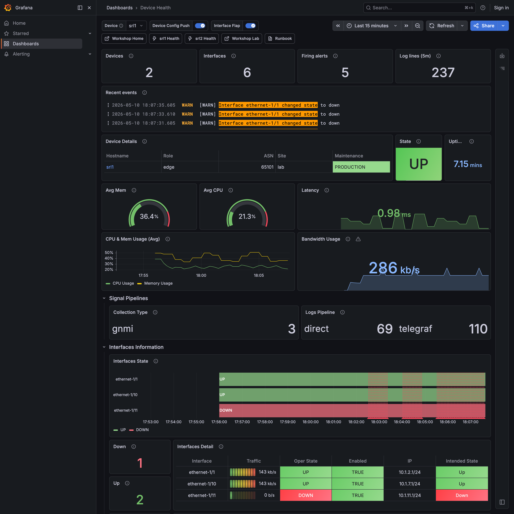

Part 1 of 4 · Morning

<h1 class="autocon5-section-hero__title">Telemetry and queries</h1>

Find the broken peer. Bridge metric → log. Build the baseline.

Your senior buddy walks you through the lab's telemetry shape — what *normal* looks like, where the broken things hide, how to bridge a metric anomaly to the log line that explains it. By the end you have a baseline you can compare every future triage against.

  ~75 minutes
  PromQL + LogQL from first principles
  Live data, real-shape telemetry

<figure class="section-preview" markdown>

[{ .screenshot loading=lazy }](../assets/screenshots/device-health-srl1.png)

<figcaption>Device Health for srl1 — the dashboard you'll query against. The interface state matrix and BGP-peer panels are where the broken peer lives. Click for full size.</figcaption>

</figure>



<nav class="autocon5-nav-footer" markdown>

<a class="autocon5-nav-footer__next" href="../part-2/">
  Next →
  Part 2 — Dashboards
</a>

</nav>
