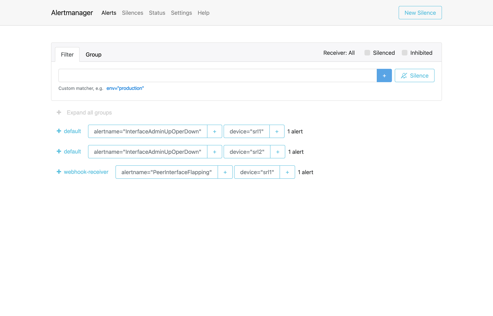
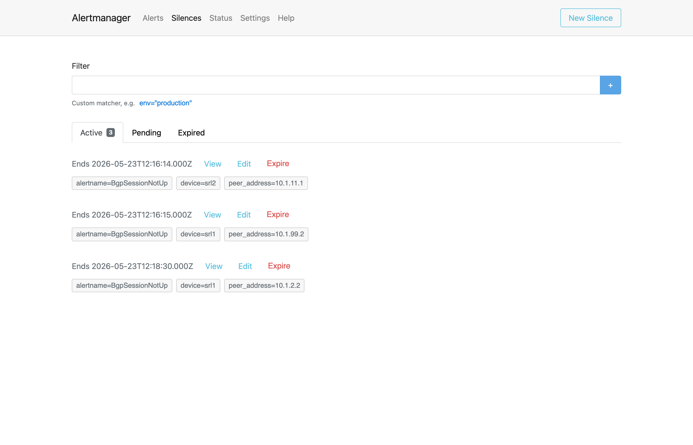
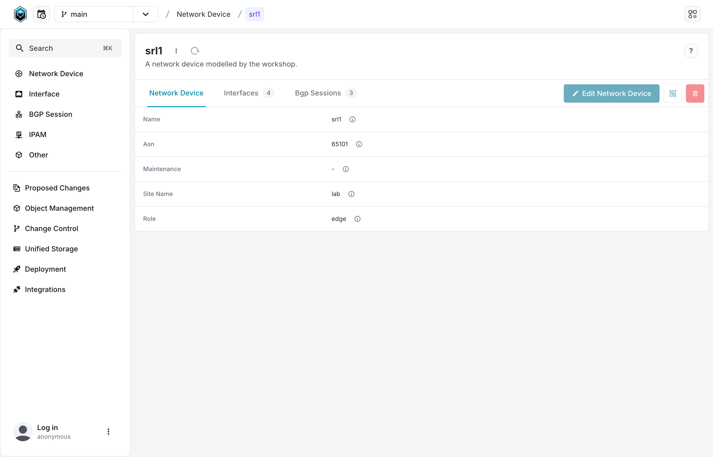
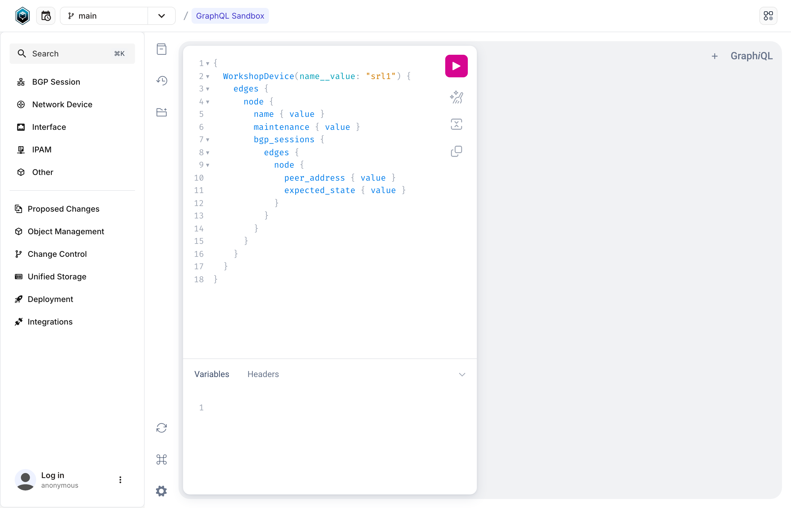

<div class="autocon5-section-hero" markdown>

<span class="autocon5-section-hero__badge">Workshop overview · Reference</span>

<h1 class="autocon5-section-hero__title">Tour the stack</h1>

<p class="autocon5-section-hero__subtitle">Six UIs, six URLs, and what to click in each one.</p>

The workshop runs ~21 containers. You only ever look at six of them: **Sonda server**, **Prometheus**, **Alertmanager**, **Grafana**, **Prefect**, and **Infrahub**. This page is the single reference for how to reach each one, what to expect when you do, and where it shows up in the four parts.

<p class="autocon5-section-hero__meta">
  <span>Read it once, refer back when you're lost</span>
  <span>All URLs are localhost</span>
  <span>Defaults match the shipped <code>.env</code></span>
</p>

</div>

## Sonda server — the synthetic telemetry control plane

### What this is

**Sonda** is a synthetic telemetry generator. Instead of running real network devices (which need disk, RAM, licenses, and patience), Sonda runs a small HTTP server that *pretends* to be one — it emits fake-but-realistic Prometheus metrics and syslog lines on the same shapes your collectors expect, so the rest of your observability stack (Telegraf, Prometheus, Loki, Grafana, alert rules) can be wired up and exercised against a known-shaped workload. Think of it as a controllable traffic generator, but for telemetry instead of packets.

In this workshop, the Sonda server at <http://localhost:8085> is the box that pretends to be `srl1` and `srl2`. Every metric Prometheus stores and every log line Loki indexes during the workshop ultimately came out of a Sonda scenario. There's no UI — it's an HTTP API, and you'll mostly poke it with `curl` (or with `nobs autocon5 scenarios`). The unit of work is a **scenario**: a small recipe that says *"emit this metric, with these labels, on this cadence, with this shape"*.

A single workshop boot registers **76 scenarios** — sonda-server fans each `kind: composable` pack out into one scenario per metric (38 per device, 2 devices). One scenario emits one metric series; the ID is a server-assigned UUID and the `name` is the metric name (`srl_bgp_oper_state`, `bgpPeerState`, `cpu_used`, …).

### Endpoints worth knowing

| Endpoint | What it returns |
|----------|-----------------|
| `GET /health` | Liveness probe. Returns `{"status":"ok"}`. |
| `GET /scenarios` | Every scenario currently registered on the server, with `id` (UUID), `name` (metric name), `state`, `elapsed_secs`, `degraded`. |
| `GET /scenarios/{uuid}` | One scenario's live handle: identity (`id`, `name`), `state`, `elapsed_secs`, plus an embedded `stats` block. |
| `GET /scenarios/{uuid}/stats` | Per-scenario emission counters: `total_events`, `current_rate`, `target_rate`, `bytes_emitted`, `errors`, `consecutive_failures`, gap/burst state, and `last_successful_write_at`. |
| `GET /scenarios/{uuid}/metrics` | The single Prometheus-text sample this scenario is emitting right now. Drained on read — telegraf is also a reader, see the curl example below. |
| `POST /scenarios` | Register a new scenario. The cascade flap (`nobs autocon5 flap-interface`) is one of these. |
| `DELETE /scenarios/{uuid}` | Stop and unregister a scenario. |

### Try it

The friendly version — `nobs autocon5 scenarios` renders the same data as a Rich table:

```bash
nobs autocon5 scenarios
```

```text
                                Sonda scenarios
┏━━━━━━━━━━━━━━━━━━━━━━━━━━━━━━━━━━━━━━┳━━━━━━━━━━━━━━┳━━━━━━━━━┳━━━━━━━━━━━━━━┓
┃ ID                                   ┃ Name         ┃  Status ┃      Elapsed ┃
┡━━━━━━━━━━━━━━━━━━━━━━━━━━━━━━━━━━━━━━╇━━━━━━━━━━━━━━╇━━━━━━━━━╇━━━━━━━━━━━━━━┩
│ 43ce9ec6-69e6-4399-b391-658aef80ab9e │ srl_interfa… │ running │ 46.807211768 │
│ 89e1545f-fbd7-4697-8c91-eea2525676a1 │ bgpPeerInPr… │ running │ 46.792552712 │
│ bfb5cb1e-9347-4dae-beea-f4b96f157c9f │ srl_interfa… │ running │ 46.807401224 │
│ 113cbb45-a5b8-4ad8-8e37-48d6817688fc │ bgpPeerOutP… │ running │ 46.793196957 │
│ bc393eea-4aa0-49dd-8310-7cdd924812ae │ bgpPeerState │ running │  46.79315354 │
│ …                                    │ …            │ …       │ …            │
└──────────────────────────────────────┴──────────────┴─────────┴──────────────┘
```

The raw version — same data, just `curl`:

```bash
curl -s http://localhost:8085/scenarios | jq '.scenarios[0]'
```

```json
{
  "id": "43ce9ec6-69e6-4399-b391-658aef80ab9e",
  "name": "srl_interface_out_octets",
  "state": "running",
  "elapsed_secs": 46.854853114,
  "degraded": false
}
```

To see the actual Prometheus-text sample a single scenario is emitting — the byte-for-byte input Telegraf reads, before any rename or normalization — pick a scenario UUID and curl its `/metrics`. Telegraf scrapes the same endpoint every 10 seconds and drains the buffer on every read, so under steady state your curl will see empty output every time. Pause both Telegrafs for one cycle, let the buffer fill, then curl:

```bash
# pick the UUID of the srl1 broken-peer oper-state scenario
ID=$(curl -s http://localhost:8085/scenarios \
  | jq -r '.scenarios[] | select(.name=="srl_bgp_oper_state") | .id' \
  | head -1)

docker pause telegraf-srl1 telegraf-srl2 && sleep 12
curl -s "http://localhost:8085/scenarios/${ID}/metrics"
docker unpause telegraf-srl1 telegraf-srl2
```

```text
srl_bgp_oper_state{afi_safi_name="ipv4-unicast",collection_type="gnmi",name="default",neighbor_asn="65102",peer_address="10.1.99.2",source="srl1"} 5 1779540408007
```

Note the metric name (`srl_bgp_oper_state`) and the `source="srl1"` tag — that's the gNMI shape SR Linux puts on the wire. Compare it to what Prometheus stores after Telegraf renames it (`bgp_oper_state{device="srl1",...}`) and you've seen the entire normalization pipeline end-to-end. Part 1's exercise 6 walks both sides.

### Inspect the catalog from inside the container

The catalog of packs and scenarios Sonda resolves `pack:` refs against is mounted at `/catalog` inside the `sonda-server` container. The `sonda` CLI is also baked in — the container ships both `sonda-server` and the `/sonda` binary, so you can run any CLI command against the same catalog the server is using:

```bash
docker compose --project-name autocon5 exec sonda-server \
  /sonda --catalog /catalog list --kind composable
```

```text
KIND        NAME                        TAGS  DESCRIPTION
composable  cisco_snmp_bgp_raw                Cisco-style SNMP BGP per-peer metrics (raw, pre-normalization, BGP4-MIB / CISCO-BGP4-MIB)
composable  cisco_snmp_interface_raw          Cisco-style SNMP per-interface metrics (raw, pre-normalization, IF-MIB)
composable  srlinux_gnmi_bgp                  SR Linux gNMI BGP per-peer metrics (Telegraf-normalized)
composable  srlinux_gnmi_bgp_raw              SR Linux gNMI BGP per-peer metrics (raw, pre-normalization)
composable  srlinux_gnmi_interface            SR Linux gNMI per-interface metrics (Telegraf-normalized)
composable  srlinux_gnmi_interface_raw        SR Linux gNMI per-interface metrics (raw, pre-normalization)
composable  srlinux_ping                      Ping reachability + latency (Telegraf inputs.ping shape)
```

Drop `--kind composable` to also list runnable scenarios in the catalog, or swap `list` for `show <name>` to dump a pack's raw YAML.

### Where you'll see this in the workshop

- **Part 1** — When you query Prometheus and see `bgp_oper_state{device="srl1"}` go from 6 to 5, that's a value Sonda is generating right now. `curl http://localhost:8085/scenarios/{id}/metrics` shows you the raw side of that same number.
- **Part 3** — `nobs autocon5 flap-interface` and `nobs autocon5 incident` both POST cascade scenarios to this server.
- **Advanced** — When you write your own scenario, you'll POST it here.

## Prometheus — the metrics store

### What this is

**Prometheus** is a time-series database for metrics, plus a query language (PromQL) for asking questions about them. It pulls samples on a schedule from anything that exposes a `/metrics` endpoint in its text format, stores them, and lets you graph or alert on them. It's the de-facto standard for cloud-native monitoring; if you've worked anywhere with Kubernetes you've probably brushed up against it.

In this workshop, Prometheus at <http://localhost:9090> stores every metric Telegraf scrapes off the Sonda fake devices. The same Prometheus instance also evaluates the alerting rules that drive Alertmanager and the recording rules that smooth out per-interval rate calculations.

### The four pages you'll actually use

| Page | URL | What it tells you |
|------|-----|-------------------|
| Query browser | <http://localhost:9090/graph> | Type PromQL, get a graph or a table. Your main tool in Part 1. |
| Targets | <http://localhost:9090/targets> | Every scrape target Prometheus knows about, with last-scrape time and `up{}` status. |
| Alerts | <http://localhost:9090/alerts> | Every alerting rule, with its current state (`inactive`, `pending`, `firing`). |
| Rules | <http://localhost:9090/rules> | Every recording and alerting rule, with last-eval time and error count. |

### Targets — verifying telemetry is flowing

Open <http://localhost:9090/targets>. You should see at least two scrape jobs **UP**:

- `telegraf-srl1` (port `9005` inside the workshop network) — feeds the gNMI-style raw metrics from Sonda.
- `telegraf-srl2` (port `9005`) — feeds the SNMP-style raw metrics.

<figure class="section-preview" markdown>

{ .screenshot loading=lazy }
{ .screenshot loading=lazy }

<figcaption><strong>Prometheus — Targets</strong> · <code>localhost:9090/targets</code>. Three jobs in this lab: <code>prometheus</code> scraping itself, <code>telegraf-srl1</code>, and <code>telegraf-srl2</code>. All green <strong>UP</strong> badges is what you want; one DOWN is the silent root cause of half the "my dashboard is empty" tickets.</figcaption>

</figure>

If either says **DOWN**, the rest of the lab breaks silently. The first thing to check when "my dashboard is empty" — far more often a target issue than a query issue.

### Queries to try

Open the query browser at <http://localhost:9090/graph>. These three queries are the spine of Part 1:

```promql
interface_oper_state
```

Returns one series per `{device, name}` interface pair. `1` is up, `2` is down — the SR Linux convention. Look for the one stuck at `2`.

```promql
bgp_oper_state{device="srl1"}
```

BGP per-peer operational state on srl1. `6` is `established`, `5` is `active`, anything else is degraded. One row should be stuck at `5`.

```promql
ALERTS{alertstate="firing"}
```

Every alert Prometheus has evaluated as `firing` in the last minute. This is the same set Alertmanager has live.

<figure class="section-preview" markdown>

{ .screenshot loading=lazy }
{ .screenshot loading=lazy }

<figcaption><strong>Prometheus — Query browser</strong> · <code>localhost:9090/graph</code>. The intent-vs-reality query from Part 1, evaluated against the live lab. Two rows — both broken peers — with the <code>oper_state=5</code> value preserved by the <code>and on (...)</code> join.</figcaption>

</figure>

### Alerts and rules

The alerts page (<http://localhost:9090/alerts>) groups every rule by file. `inactive` is normal — the rule is being evaluated, condition just isn't met. `pending` means the condition matched but hasn't been true for the rule's `for:` duration yet. `firing` means the alert has been sent to Alertmanager.

<figure class="section-preview" markdown>

{ .screenshot loading=lazy }
{ .screenshot loading=lazy }

<figcaption><strong>Prometheus — Alerts</strong> · <code>localhost:9090/alerts</code>. Rule files grouped by source (<code>autocon5_bgp_rules.yml</code>, <code>autocon5_interface_rules.yml</code>, …) with each rule's current state badge.</figcaption>

</figure>

The rules page (<http://localhost:9090/rules>) is where recording rules live. The workshop ships several — `device:network_traffic_in_bps:rate_2m` precomputes a 2-minute traffic rate per device so dashboards don't re-derive it for every panel. If a rule's "Health" column is `err`, expand it to see the query and the error.

### Where you'll see this in the workshop

- **Part 1** — the query browser is open the whole time.
- **Part 2** — when you build the flap-rate panel in Grafana, you're writing PromQL that runs against this Prometheus.
- **Part 3** — `BgpSessionNotUp` is one of the rules on this page; firing alerts here become webhook payloads to Prefect.

## Alertmanager — the alert router and silence store

### What this is

**Alertmanager** is the deduplication-and-routing layer that sits between Prometheus and wherever alerts actually need to go (email, Slack, PagerDuty, a webhook). Prometheus decides *whether* a condition is firing; Alertmanager decides *who hears about it, how often, and grouped how*. It also stores **silences** — time-bounded mute rules that suppress matching alerts without changing the underlying rule. Think of it as a smarter Nagios notifier: same job (turn an alert into a page), but with deduplication, label-based routing, grouping, and silences built in.

In this workshop, Alertmanager at <http://localhost:9093> receives every `firing` alert from Prometheus, deduplicates and groups them, and routes them out to the FastAPI webhook that hands off to a Prefect flow. The Prefect quarantine flow uses the silence API to mute alerts it's already containing.

### The two pages you'll actually use

| Page | URL | What it tells you |
|------|-----|-------------------|
| Alerts | <http://localhost:9093/#/alerts> | Every active alert grouped by labels, with `Active` / `Suppressed` state. |
| Silences | <http://localhost:9093/#/silences> | Every silence the workshop has created, with creator, matchers, and expiry. |

### Alerts page

Each active alert shows its labels (`alertname=BgpSessionNotUp`, `device=srl1`, `peer_address=10.1.99.2`, …) plus a state badge. `Active` means the alert is being routed normally. **`Suppressed`** means a matching silence is in effect — for this workshop, that almost always means the Prefect quarantine flow caught the alert, decided it warranted containment, and silenced it for 20 minutes while it worked.

<figure class="section-preview" markdown>

{ .screenshot loading=lazy }

<figcaption><strong>Alertmanager — Alerts</strong> · <code>localhost:9093/#/alerts</code>. Groups by routing target — <code>default</code> (the two <code>InterfaceAdminUpOperDown</code> alerts that didn't match the BGP webhook route) and <code>webhook-receiver</code> (the <code>PeerInterfaceFlapping</code> that did). Click any group to expand the matching alerts and their full label set.</figcaption>

</figure>

You can click any alert to expand the full label set. The labels are what the Prefect flow reads when it asks Infrahub *"is this peer expected up?"* — `device` and `peer_address` are the keys.

### Silences page

The silences page is the auditable record of every containment action. When the quarantine flow runs successfully on an alert, you'll see a silence here with:

- **Matchers**: `alertname=BgpSessionNotUp`, `device=srl1`, `peer_address=10.1.99.2`
- **Creator**: `prefect-flow`
- **Comment**: `quarantine: cascade-protect (peer flapping with high rate)`
- **Ends**: 20 minutes after creation

You can manually expire a silence here too — the **Expire** button removes it immediately, and the alert returns to `Active` on the next evaluation cycle.

<figure class="section-preview" markdown>

{ .screenshot loading=lazy }

<figcaption><strong>Alertmanager — Silences</strong> · <code>localhost:9093/#/silences</code>. Three active silences in this snapshot: the two always-broken peers (<code>srl1→10.1.99.2</code>, <code>srl2→10.1.11.1</code>) that the Prefect flow quarantined on startup, plus a fresh one for <code>srl1→10.1.2.2</code> from a cascade <code>flap-interface</code>. Each shows its matchers, expiry timestamp, and an <strong>Expire</strong> button.</figcaption>

</figure>

### CLI equivalents

The `nobs autocon5 alerts` command renders the alerts page as a table:

```bash
nobs autocon5 alerts
```

Useful when you just want a quick "what's firing right now?" without leaving the terminal.

### Where you'll see this in the workshop

- **Part 1** — you check that morning's two `BgpSessionNotUp` alerts are here, then trace them backwards to a single PromQL query.
- **Part 3** — the entire flow lives in this page. Every `try-it` run either creates a silence (quarantine) or doesn't (skip/audit), and the silence is the visible evidence.

## Grafana — dashboards and Explore

### What this is

**Grafana** is the visualization layer — dashboards, ad-hoc query exploration, and one UI on top of many backends. You've almost certainly seen one. In this workshop, Grafana at <http://localhost:3000> (login `admin` / `admin`, or whatever you set in `.env`) has three datasources pre-wired: **Prometheus** for metrics, **Loki** for logs, and **Infrahub** (GraphQL via the Infinity datasource) for intent. Dashboards and the Explore mode can query any of them without setup.

### Pre-provisioned dashboards

| Dashboard | URL | What it's for |
|-----------|-----|---------------|
| **Workshop Home** | <http://localhost:3000/d/workshop-home> | The landing page. Currently firing alerts, recent event feed, a list of starter queries with one-click links into Explore. |
| **Workshop Lab 2026** | <http://localhost:3000/d/dfb5dpyjbh2wwa> | Side-by-side panels for the day's exercises. Interface oper status timeline lives here. |
| **Device Health** | <http://localhost:3000/d/c78e686b-138b-4deb-b6ae-3239dc10a162> | Per-device deep dive. BGP peer states, interface state, device-level CPU/memory/uptime. |

### What the panels look like

<figure class="section-preview" markdown>

{ .screenshot loading=lazy }
{ .screenshot loading=lazy }

<figcaption><strong>BGP States</strong> · Device Health (srl1) — three peers, two ESTABLISHED (green) and one stuck in ACTIVE (orange). That orange row is the deliberately-broken peer you find in Part 1 with a single intent-vs-reality query.</figcaption>

</figure>

<figure class="section-preview" markdown>

{ .screenshot loading=lazy }
{ .screenshot loading=lazy }

<figcaption><strong>Recent events</strong> · Workshop Home — three streams interleaved in time order: interface state-change logs from a flap cascade, <code>maintenance</code> trigger lines from the CLI, and Prefect workflow annotations (<code>decision=proceed</code>/<code>skip</code>/<code>resolved</code>, <code>QUARANTINE applied</code>, AI RCA narratives). Quiet at rest; the feed lights up when you drive a <code>flap-interface</code>, toggle <code>maintenance</code>, or any Prefect flow runs.</figcaption>

</figure>

<figure class="section-preview" markdown>

{ .screenshot loading=lazy }
{ .screenshot loading=lazy }

<figcaption><strong>Currently firing alerts</strong> · Workshop Home — what Alertmanager has live right now. The input the Prefect automation reasons over in Part 3.</figcaption>

</figure>

<figure class="section-preview" markdown>

{ .screenshot loading=lazy }
{ .screenshot loading=lazy }

<figcaption><strong>Interface Operational Status</strong> · Workshop Lab — the state timeline for srl1's interfaces. You'll learn to read this in Part 1 and add a flap-rate panel right next to it in Part 2.</figcaption>

</figure>

### Explore mode

The compass icon in the left nav opens **Explore**. Pick a datasource at the top (`prometheus`, `loki`, or `infrahub`), type a query, pick a time range, hit **Run query**. This is where you'll iterate on PromQL and LogQL outside of any dashboard. Every "starter query" link on Workshop Home drops you straight into Explore with the query prefilled.

### Where you'll see this in the workshop

- **Part 1** — Explore mode for PromQL and LogQL practice, Workshop Home for the firing alerts feed.
- **Part 2** — you live in the dashboard editor adding the flap-rate panel.
- **Part 3** — Workshop Home's "Currently firing alerts" panel is your hand-off into the Prefect flow.

## Prefect — workflows, deployments, runs

### What this is

**Prefect** is a Python-native, event-driven workflow orchestrator. Two pieces of jargon worth unpacking up front:

A **workflow orchestrator** is software that takes a sequence of tasks — in Prefect's case, plain Python functions — runs them in the right order, handles retries and failures, tracks state, and gives you a UI to watch what happened after the fact. Think of it as a build system like Jenkins or GitHub Actions, but for operational automations instead of CI pipelines: the same "DAG of steps with logs and a results screen" shape, just pointed at ops work instead of "did the tests pass?".

**Event-driven** means the workflows don't run on a cron schedule — they fire in response to external events (a webhook, a message on a queue, a file appearing, another flow completing). That's the property that makes Prefect a natural fit for the *alert → automation* pipeline in this workshop: Alertmanager calls a webhook, the webhook hands the payload to Prefect, Prefect runs the deterministic flow, and every step is visible afterwards.

### Why this workshop uses it

Network ops needs automation that is **deterministic, auditable, and debuggable**: when an alert fires, the same decision tree should run every time; an operator should be able to pull up *exactly* what happened on alert #847 three days later; and the per-step logs should be one click away. Prefect ships all three of those (flow runs, task graphs, per-task logs) out of the box, in Python, with a sane Docker deployment — and that's the entire reason it's here. The automation glue around Infrahub, Prometheus, and Alertmanager is already Python; Prefect runs locally on the workshop laptop without any external infra (it brings its own Postgres + Redis + server + worker compose set); and its UI *is* the audit trail — no separate dashboard or log-shipping glue to maintain.

Workflow orchestrators are not a one-vendor space — Airflow, Temporal, Dagster, Argo Workflows all play in adjacent corners. Prefect's sweet spot is **event-driven Python automation with a usable UI**, which fits the alert-handler use case better than the schedule-batch-oriented alternatives. If your team already runs one of the others, the patterns in Part 3 port across; Prefect is the implementation, not the lesson.

In this workshop, Prefect at <http://localhost:4200> orchestrates the quarantine workflow that picks up alerts from the webhook. The lab runs Prefect 3 with a Postgres + Redis backend, a worker on the `local-pool` pool, and a flow-server container that registers the `alert-receiver` deployment on startup.

!!! info "Further reading"

    For a deeper take on workflow orchestration's role in network automation architecture, see Christian Adell's *[Designing Network Automation at Scale](https://designingnetworkautomation.com/)* — Chapter 7 (*Orchestration*) covers the design tradeoffs in detail. The book is published as an open online resource at <https://designingnetworkautomation.com/>.

### The three concepts you need

| Concept | What it is | Example in the lab |
|---------|------------|--------------------|
| **Flow** | The Python function. The code. | `quarantine_bgp_flow` — collect evidence, evaluate policy, decide, act, annotate. |
| **Deployment** | A schedulable, invokable wrapper around a flow with default parameters and a target work pool. | `alert-receiver/alert-receiver` — what the webhook calls when an alert lands. |
| **Flow run** | One execution of a deployment (or an ad-hoc flow). Has its own logs and task graph. | Every `try-it` run, every cascade you flap, every direct trigger. |

### The four pages you'll actually use

| Page | URL | What it tells you |
|------|-----|-------------------|
| Runs | <http://localhost:4200/runs> | Every flow run, with state (`Completed`, `Failed`, `Running`), duration, parameters. |
| Deployments | <http://localhost:4200/deployments> | Every registered deployment. Click one to see its parameter schema and trigger an ad-hoc run. |
| Flows | <http://localhost:4200/flows> | Every flow the workers know about, with a count of runs and recent state distribution. |
| Automations | <http://localhost:4200/automations> | Triggers that fire on Prefect-side events (state changes, deployment completions). Empty in the default lab. |

### Runs page — the audit trail

<figure class="section-preview" markdown>

{ .screenshot loading=lazy }
{ .screenshot loading=lazy }

<figcaption><strong>Prefect — Runs</strong> · <code>localhost:4200/runs</code>. Every alert payload the webhook handed off shows up here as a completed flow run.</figcaption>

</figure>

Click a run to drill in. The detail page has the task graph, parameters, logs, and result.

<figure class="section-preview" markdown>

{ .screenshot loading=lazy }
{ .screenshot loading=lazy }

<figcaption><strong>Prefect — Flow run detail</strong> · the task graph for <code>quarantine_bgp</code> (collect_evidence → evaluate_policy → annotate_decision → ai_rca → quarantine → annotate_action) with the per-task log feed underneath.</figcaption>

</figure>

The task graph is the single best place to debug a quarantine decision — every task's output is visible, so you can see exactly what evidence the flow collected, what policy it evaluated, and which path it took. The per-task logs underneath stream live during a run.

### Where you'll see this in the workshop

- **Part 3** spends most of its time in here. You'll trigger four canonical paths from `try-it`, then watch each one render as a flow run.
- **Advanced** — you reason about Prefect runs as your audit trail when you write the final incident runbook.

## Infrahub — source of truth

### What this is

**Infrahub** is a *source of truth* (sometimes called an *intent store*) for network infrastructure — a database that stores **what should be true** about your network: which devices exist, what their roles are, which BGP sessions are *supposed* to be up, who they're peering with, whether a device is currently in maintenance. If you've used **NetBox** or **Nautobot** as a DCIM, you already know the genre — Infrahub plays in the same space, with a richer schema engine and built-in branching (you can propose a config change on a branch, diff it, and merge it, like Git for infrastructure data).

The reason intent matters in alerting is simple: a bare alert says *"this BGP session is down"*, but the right question to ask is *"was this session **supposed** to be up?"* — and the only place that knows is the source of truth. A peer in scheduled maintenance, a session that was decommissioned last week, a peer that's intentionally left configured but down for testing — all three look identical in metrics, but the *correct* response to each is different. Pulling intent into the alert pipeline is what turns a noisy alert into a real incident decision.

In this workshop, Infrahub at <http://localhost:8000> (login `admin` / `infrahub`) stores intent — device roles, expected BGP sessions, maintenance windows — that the Prefect flow consults before deciding what to do with an alert.

### What's loaded

`nobs autocon5 load-infrahub` (which you ran during setup) applies the workshop schema and seeds two `WorkshopDevice` records (`srl1`, `srl2`), each with their `BgpSession` relationships. The schema fields the policy reads:

- `name`, `asn`, `role`, `site_name` — basic identity.
- `maintenance` — boolean. If `true`, the flow skips quarantine.
- `bgp_sessions` (relationship) — each with `peer_address`, `afi_safi`, `expected_state`, `remote_as`, `expected_prefixes_received`, `reason`.

### The three places you'll actually use

| Where | URL | What it tells you |
|-------|-----|-------------------|
| WorkshopDevice list | <http://localhost:8000/objects/WorkshopDevice> | Browse `srl1` and `srl2`, click into the per-device attribute view. |
| GraphQL Sandbox | <http://localhost:8000/graphql> | Run the exact query the Prefect flow runs. Edit it, see what changes. |
| Branch indicator | top-right of every page | Infrahub is branch-aware. `main` is the live branch the flow reads. |

### WorkshopDevice detail

<figure class="section-preview" markdown>

{ .screenshot loading=lazy }

<figcaption><strong>Infrahub — <code>WorkshopDevice/srl1</code></strong> · the intent the flow consults: ASN, Maintenance, Site Name, Role, plus Interfaces and BGP Sessions on the tabs above. Toggle Maintenance here and the next alert for this device is skipped by the policy.</figcaption>

</figure>

Navigate via **Object Management → WorkshopDevice → srl1**. The **bgp_sessions** tab shows every BGP session relationship — click a row (e.g., `10.1.99.2`) and you'll see `Expected State = Established`, `Reason = ip-mismatch-demo`. That's the per-peer intent the flow's policy compares against the live `bgp_oper_state` metric in Prometheus.

### GraphQL Sandbox

<figure class="section-preview" markdown>

{ .screenshot loading=lazy }

<figcaption><strong>Infrahub — GraphQL Sandbox</strong> · <code>localhost:8000/graphql</code>. The exact <code>DeviceIntent</code> query the Prefect flow runs against Infrahub. No secret access — anyone can run this and see what the policy sees.</figcaption>

</figure>

This is the exact query the Prefect flow runs (verbatim from `automation/workshop_sdk.py`). Paste it in, hit run, and you'll see the same answer the policy got:

```graphql
query DeviceIntent {
  WorkshopDevice(name__value: "srl1") {
    edges {
      node {
        name { value }
        maintenance { value }
        site_name { value }
        role { value }
        bgp_sessions {
          edges {
            node {
              peer_address { value }
              expected_state { value }
              remote_as { value }
              reason { value }
            }
          }
        }
      }
    }
  }
}
```

The flow has no secret access — anything you can read here, it reads with the same query.

### Where you'll see this in the workshop

- **Part 1** — you cross-reference an alert against intent: *"Infrahub says this peer should be `established`; Prometheus says `active`."* That's the diff that turns a noisy alert into a real incident.
- **Part 3** — toggling `maintenance` on a device (via `nobs autocon5 maintenance --device srl1 --state` or directly in the UI) is what makes the policy take the skip path on the next alert. The flow re-reads Infrahub on every alert.
