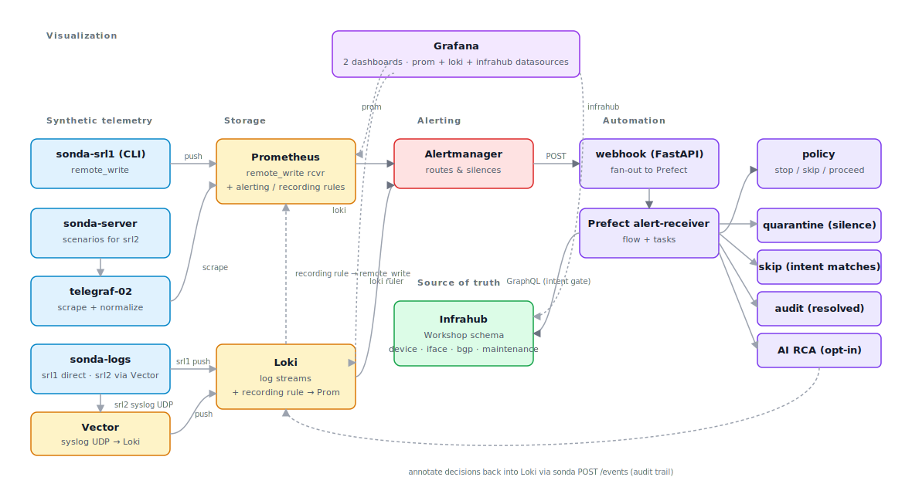

# AutoCon5 — Modern Network Observability Workshop

A four-hour, laptop-friendly workshop.
You bring a laptop with Docker; we bring a self-contained observability stack (Prometheus, Loki, Grafana, Alertmanager) plus a synthetic telemetry generator that stands in for a small network.
By lunchtime you'll have queried real-shaped telemetry, made a dashboard answer an operational question, watched alerts route through an automated workflow, and seen what an opt-in AI RCA step does next to that workflow.

> **Format:** ~20% framing and guided demos, ~80% hands-on.
> The whole stack runs locally — no shared backend, no live network gear.

## Agenda (Tuesday, 09:00 – 13:00)

| Time | Part | What |
|------|------|------|
| 09:00 – 09:30 | Framing | From monitoring to modern observability; lab tour |
| 09:30 – 10:45 | **Part 1** | Network telemetry & queries — metrics + logs |
| 10:45 – 11:15 | Break | ☕ |
| 11:15 – 11:55 | **Part 2** | Making the data usable — dashboards |
| 11:55 – 12:55 | **Part 3** | Alerts, automation, AI-assisted operations |
| 12:55 – 13:00 | Close | Key takeaways |

## Before you arrive

Run the preflight from anywhere in the repo:

```bash
nobs preflight
```

It checks Docker, Compose v2, Python, RAM, free disk, and outbound reachability to `ghcr.io`, `docker.io`, and `github.com`.
Resolve any `[FAIL]` lines before the workshop.

You also need:

- **Docker** (or Docker Desktop / Colima / Rancher Desktop) with **Compose v2**.
  On Windows, run everything inside **WSL 2**.
- **[uv](https://docs.astral.sh/uv/)** for the workshop's Python helpers (Infrahub loader, maintenance toggle).
  Install with `curl -LsSf https://astral.sh/uv/install.sh | sh`.
  uv installs its own pinned Python, so a system Python isn't required.
- ~8 GB of free RAM and ~5 GB of free disk while the stack is running

## Bring it up

The very first time, in this order:

```bash
uv sync --all-packages          # install workspace deps into .venv/
uv run nobs setup               # bootstrap .env + preflight
uv run nobs autocon5 up         # first run pulls images, ~5–10 min
uv run nobs autocon5 status     # repeat until every row says 'ok'
uv run nobs autocon5 load-infrahub
```

Once the stack is up and Infrahub is seeded, you'll have:

| Service | URL | Notes |
|---------|-----|-------|
| Grafana | http://localhost:3000 | login `admin` / `admin` (or whatever you set in `.env`) |
| Prometheus | http://localhost:9090 | targets, rules, query browser |
| Alertmanager | http://localhost:9093 | active alerts + silences |
| Loki | http://localhost:3001 | LogQL endpoint (queried from Grafana) |
| Infrahub | http://localhost:8000 | source-of-truth UI + GraphQL playground |
| Prefect | http://localhost:4200 | workflow runs in Part 3 |
| Sonda HTTP API | http://localhost:8085 | the synthetic telemetry control plane |

When you're done:

```bash
nobs autocon5 down       # stop everything but keep volumes
nobs autocon5 destroy    # full reset (drops volumes too)
```

If anything misbehaves during the workshop, ask the instructor — they have the operator runbook in [`docs/troubleshooting.md`](docs/troubleshooting.md).

## What's actually running



In words: synthetic telemetry from sonda lands in Prometheus and Loki.
Alerting rules in both stores route through Alertmanager into a FastAPI webhook, which fans out to a Prefect flow.
The flow consults **Infrahub** for source-of-truth intent (is this peer expected up? is the device in maintenance?) before deciding to **quarantine**, **skip**, or just **audit** — and optionally runs an AI RCA against the same evidence bundle.
Every decision is annotated back into Loki for the audit trail.

The telemetry shape (metric names, labels, log streams) is real — sonda emits the same patterns a Nokia SR Linux device would.
That's why the queries, dashboards, and alerts you build look exactly like what you'd write against a production network.

## Part 1 — Network telemetry and queries

Open Grafana → **Explore**, pick the `prometheus` datasource, and try:

```promql
interface_admin_state{intf_role="peer"}
interface_oper_state{intf_role="peer"}

# What links does intent say should be UP that aren't?
(interface_admin_state{intf_role="peer"} == 1)
  and on (device, name)
(interface_oper_state{intf_role="peer"} == 2)
```

Then switch to the `loki` datasource:

```logql
{device="srl1"}
{vendor_facility_process="UPDOWN"} | line_format "{{.device}} {{.interface}} {{.message}}"
sum by (device, interface) (count_over_time({vendor_facility_process="UPDOWN"}[2m]))
```

The "broken" peers are wired in on purpose: `srl1 → 10.1.99.2` and `srl2 → 10.1.11.1`.
Those drive the BGP alerts in Part 3.

## Part 2 — Dashboards

Three dashboards ship pre-provisioned under `/var/lib/grafana/dashboards`:

- **Workshop Lab 1** — the attendee scratchpad.
  You'll add a panel here.
- **Device Health** — the "one dashboard, one story" reference.
- **Meta-monitoring** — health of the observability stack itself.

The hands-on exercise is in the workshop slides; you'll add a panel to **Workshop Lab 1** that uses a `device` variable so it works across both `srl1` and `srl2`.

## Part 3 — Alerts, automation, AI-assisted ops

Two alerts fire automatically against the running telemetry:

- **`BgpSessionNotUp`** — `bgp_admin_state=1` and `bgp_oper_state≠1` for the intentionally broken peers (`srl1 → 10.1.99.2`, `srl2 → 10.1.11.1`).
- **`PeerInterfaceFlapping`** — `count_over_time({vendor_facility_process="UPDOWN"}[2m]) > 3`.

Alertmanager forwards both to a FastAPI webhook, which kicks off the Prefect `alert-receiver` flow.
That flow runs the four canonical paths from the outline:

| Path | When | What happens |
|------|------|--------------|
| **Actionable / mismatch → quarantine** | Intent says peer up, metrics disagree | Silence + annotation |
| **Healthy → skip** | Intent and metrics agree | Audit annotation only |
| **In-maintenance → skip** | Device's `maintenance` flag is true in Infrahub | Audit annotation only |
| **Resolved → audit trail** | Alert resolves | Audit annotation only |

You drive these by hand:

```bash
# Force an interface flap into the log stream — trips PeerInterfaceFlapping in ~30s.
nobs autocon5 flap-interface --device srl1 --interface ethernet-1/1

# Toggle a device into maintenance and watch the next quarantine flow skip.
nobs autocon5 maintenance --device srl1 --state
nobs autocon5 maintenance --device srl1 --clear

# Inspect what the Prefect flow would see for a given peer.
nobs autocon5 evidence srl1 10.1.99.2

# List what's currently firing.
nobs autocon5 alerts

# Walk all four canonical Part 3 paths in one go.
nobs autocon5 try-it
```

### AI-assisted RCA toggle

The Prefect flow runs an opt-in LLM RCA step against the same evidence bundle (metrics + logs + source-of-truth).
When `ENABLE_AI_RCA=false` (the default), the step still runs but annotates a clear "AI RCA disabled" message into Loki — the workflow finishes end-to-end either way.

Turn it on by editing `.env`:

```bash
ENABLE_AI_RCA=true
AI_RCA_PROVIDER=openai          # or anthropic
AI_RCA_MODEL=gpt-4o-mini        # or e.g. claude-haiku-4-5-20251001
OPENAI_API_KEY=sk-...           # only the one matching AI_RCA_PROVIDER is required
```

Then `nobs autocon5 restart prefect-flows`.
Honest framing: the LLM output is annotated next to the deterministic policy result, not in place of it.
Human judgement still owns the call to act — the AI gives you a faster narrative around the evidence, not an autonomous decision.

## Going deeper

For maintainers, instructors, and anyone forking this workshop:

- [`docs/`](docs/) — operator documentation index (architecture diagram, `.env` lifecycle, repo layout, troubleshooting).
- [`docs/env-lifecycle.md`](docs/env-lifecycle.md) — who creates `.env`, who reads it, and the host-vs-container nuance.
- [`docs/troubleshooting.md`](docs/troubleshooting.md) — the recurring failure modes and exact recovery commands.
- [`docs/repo-layout.md`](docs/repo-layout.md) — what every directory contributes and where to look when tracing a flow.
- [`infrahub/README.md`](infrahub/README.md) — the source-of-truth schema walkthrough: what the three node types are, why they look the way they do, how the upstream Nautobot model maps onto them, and the GraphQL queries Grafana + the Prefect flow run against them.
