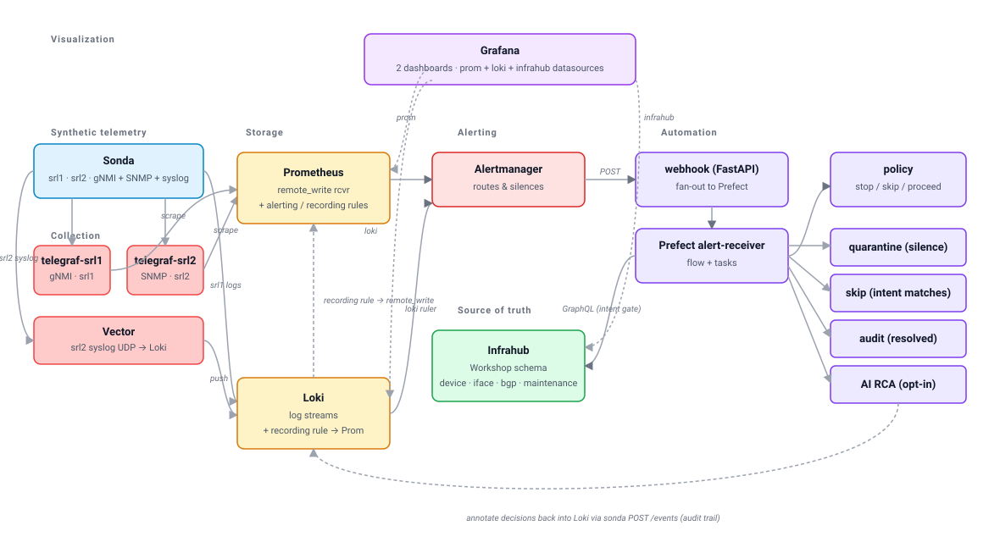

# Building a Network Observability Stack with Tools, Automation, and AI

A three-hour, online, laptop-friendly workshop from Packt Publishing.
You bring a laptop with Docker; we bring a self-contained observability stack (Prometheus, Loki, Grafana, Alertmanager) plus a synthetic telemetry generator that stands in for a small network.
By the end you'll have queried real-shaped telemetry, seen a dashboard built to answer an operational question, and driven an automated alert-response workflow — including an opt-in AI RCA step — yourself.

**Saturday 19 September 2026 · 09:00–12:00 EDT · 14:00–17:00 Europe/Dublin**
Speakers: Christian Adell, David Flores.
[Registration on Eventbrite](https://www.eventbrite.co.uk/e/building-a-network-observability-stack-with-tools-automation-and-ai-tickets-1993849714168).

> 📖 **Read this online:** <https://network-observability.github.io/workshops/packt/> — searchable, mobile-friendly docs site with the same content as this README and the hands-on guides.

## Two lanes

**Hands-on lane** — your laptop runs the stack and you type along. This is the better experience, and the pre-work below is what makes it work.

**Watching lane** — your laptop cannot run the stack (locked-down machine, not enough RAM, no time to prepare). Come anyway. Every command and every expected output is written out in the guides, we drive the whole session on screen, and Packt records it. The [take-home page](guides/take-home.md) lets you do the hands-on parts later at your own pace, with more time than three hours allows.

Part 2 is a **guided demo for everybody** — nothing in it is required for Part 3, so a stack that is still pulling images during Part 2 costs you nothing.

## Before the session

Do this a few days ahead, not on the morning. The first `up` pulls 3–5 GB of container images and builds five more locally — that is the only genuinely slow step.

```bash
git clone https://github.com/network-observability/workshops.git
cd workshops

uv sync --all-packages          # install workspace deps into .venv/
source .venv/bin/activate       # put nobs on PATH for the rest of the session
nobs preflight                  # Docker, Compose v2, RAM, disk, registry reachability
nobs packt up                   # first run pulls images, ~5–10 min
nobs packt status               # repeat until every row says 'ok'
nobs packt load-infrahub
nobs packt down                 # stop until the day; images stay cached
```

Budget **~5.5 GB of free RAM** and **~5 GB of free disk** while the stack is running. On **Windows**, run every command inside **WSL 2** — not PowerShell, not Git Bash.

New to Docker or uv? The repo's [Installing Docker and uv](../../README.md#installing-docker-and-uv) section has per-platform pointers.

Once the stack is up and Infrahub is seeded, you'll have:

| Service | URL | Notes |
|---------|-----|-------|
| Grafana | http://localhost:3000 | login `admin` / `admin` (or whatever you set in `.env`) |
| Prometheus | http://localhost:9090 | targets, rules, query browser |
| Alertmanager | http://localhost:9093 | active alerts + silences |
| Loki | http://localhost:3001 | LogQL endpoint (queried from Grafana) |
| Infrahub | http://localhost:8000 | source-of-truth UI + GraphQL playground |
| Prefect | http://localhost:4200 | workflow runs in Part 3 |
| Sonda HTTP API | http://localhost:8085 | the synthetic telemetry control plane |

When you're done:

```bash
nobs packt down       # stop everything but keep volumes
nobs packt destroy    # full reset (drops volumes too)
```

## The three hours

Times below are Dublin / EDT. Questions go through Packt's Q&A panel in the app — we read them out at block boundaries rather than mid-explanation.

| Dublin | EDT | Block |
|---|---|---|
| 14:00 | 09:00 | Stack check — preflight, status, sort out anything red |
| 14:10 | 09:10 | Framing — why observability, the two-device lab, what the three parts are |
| 14:25 | 09:25 | **Part 1** — metrics with PromQL |
| 14:50 | 09:50 | **Part 1** — logs with LogQL, and the metric-to-log bridge |
| 15:10 | 10:10 | **Part 1 — your turn.** Two questions, answers in the Q&A panel |
| 15:20 | 10:20 | Break |
| 15:30 | 10:30 | **Part 2 (demo)** — build a flap-rate panel, drive a flap |
| 15:40 | 10:40 | **Part 2 (demo)** — the alert lifecycle, firing to silenced to resolved |
| 15:50 | 10:50 | **Part 3** — setup, enable AI RCA, the alert → evidence → policy → action cycle |
| 16:05 | 11:05 | **Part 3** — walk the cycle, steps 1–5, including the maintenance branch |
| 16:40 | 11:40 | **Part 3 — your turn** plus the reflection question |
| 16:55 | 11:55 | Wrap |

### Part 1 — Network telemetry and queries · ~55 min

Morning of your first deep day on the on-call rotation. Your senior buddy walks you through the lab's telemetry shape — what "normal" looks like, where the broken things hide, how to bridge a metric anomaly to a log line that explains it. Ends with ten minutes of your own queries.

Hands-on guide: [`guides/part-1-telemetry-and-queries.md`](guides/part-1-telemetry-and-queries.md).

### Part 2 — Dashboards and Alerts · ~20 min · guided demo

A post-mortem email lands. Last night's page lost ten minutes because a flap-rate panel didn't exist yet. We build it on screen, thresholds matching the actual alert rule, then walk the same alert from panel to firing to silenced.

No hands-on here, and nothing in it is required for Part 3. The full ten-step build is on the take-home page.

Guide: [`guides/part-2-dashboards.md`](guides/part-2-dashboards.md).

### Part 3 — Alert response, Automation and AI-assisted ops · ~65 min

A real alert lands. Walk the cycle — alert, evidence, policy, action — then flip one flag in the source of truth and watch the same alert reach the opposite decision. Toggle the AI RCA step, and decide which paths you'd trust an LLM narrative on at 02:14.

Hands-on guide: [`guides/part-3-alerts-automation-ai.md`](guides/part-3-alerts-automation-ai.md).

### Take it home

Everything the three hours could not fit, in the order you'd work through it at your own pace: Part 1's recording rules, alert rules and capstone; Part 2's full ten-step panel build and stretch goals; Part 3's real-LLM swap and deep dives; and the end-to-end 02:14 investigation capstone.

[`guides/take-home.md`](guides/take-home.md).

## FAQ

**Do I need network engineering experience?**
Helpful, not required. Every concept (BGP peering, interface state, syslog UPDOWN events) is framed before you query it.

**Do I need to know Prometheus, Loki, or Grafana already?**
A sketch-level idea of "metrics database" and "log database" is enough. Part 1 builds PromQL and LogQL from scratch against live data.

**What if I've never used Docker?**
You need Docker installed and running, but you don't need to write a Dockerfile. If `docker ps` works on your laptop, you're set.

**Why do I need `uv` installed?**
We use [`uv`](https://docs.astral.sh/uv/) to install and run the workshop's `nobs` CLI — a thin wrapper that fronts every workshop command (`up`, `down`, `status`, `alerts`, `flap-interface`, and the rest). With `uv` set up the session flows through one-line commands instead of raw `docker compose` invocations.

**What if my laptop is on Windows?**
Run everything inside **WSL 2**. Docker Desktop with the WSL 2 backend. Native Windows / PowerShell isn't supported.

**How big is the stack?**
Around 21 containers, ~5.5 GB of RAM, and ~5 GB of disk. The first `nobs packt up` pulls 3–5 GB of images — that's the slow step. After that, restarts are fast.

**Can I run this offline?**
Yes, once images are pulled. The only outbound call during the session is the optional AI RCA step (needs a provider key and internet).

**Is anything sent to a remote service?**
No, by default. All telemetry, alerts, and dashboards are local. The AI RCA step defaults to a `demo` provider that generates its narrative from a local template, and only calls OpenAI or Anthropic if you set a key in `.env`.

**Is the session recorded?**
Yes — Packt records it and distributes the replay through your Packt account.

**Where do I ask questions?**
During the session, through the Q&A panel in Packt's app; we read them out at block boundaries. Afterwards, open an issue on [the workshops repo](https://github.com/network-observability/workshops/issues).

**Why simulated devices instead of real network OS containers?**
Real SR Linux or vEOS containers need 4–6 GB of RAM each, which would price most laptops out of a multi-device lab. Sonda emits the same raw shapes a real device would — gNMI for `srl1` (SR Linux-style), SNMP for `srl2` (Cisco/Arista/Juniper-style) — plus the matching syslog events, so the queries you write here are the same ones you'd run against production. If you want the full lab with real containers, the companion repo is [`network-observability-lab`](https://github.com/network-observability/network-observability-lab).

**Can I keep using this afterwards?**
Yes — fork the repo and the stack is yours. `nobs packt destroy` cleanly tears it down when you're finished.

## What's actually running



In words: synthetic telemetry from sonda lands in Prometheus and Loki.
Alerting rules in both stores route through Alertmanager into a FastAPI webhook, which fans out to a Prefect flow.
The flow consults **Infrahub** for source-of-truth intent (is this peer expected up? is the device in maintenance?) before deciding to **quarantine**, **skip**, or just **audit** — and optionally runs an AI RCA against the same evidence bundle.
Every decision is annotated back into Loki for the audit trail.

The raw telemetry sonda emits is shaped like what a real device puts on the wire: `srl1` looks like a Nokia SR Linux box streaming gNMI (`srl_bgp_oper_state`, `source=srl1`), `srl2` looks like a Cisco/Arista/Juniper box polled over SNMP (`bgpPeerState`, `agent_host=srl2`). Both pipelines land in Prometheus normalized to one canonical schema via per-device Telegraf rename rules, so the queries, dashboards, and alerts you build read against that shared shape regardless of which raw vendor protocol fed them. Part 1 walks both shapes end-to-end.

## Driving the BGP cascade (`flap-interface`)

`nobs packt flap-interface` posts a single declarative cascade scenario to sonda's `/scenarios` endpoint. The interface flap drives `interface_oper_state` via the `enum: oper_state` shorthand on sonda's `flap` generator (UP=1, DOWN=2 — gNMI / openconfig convention); the BGP per-peer metrics and a UPDOWN log stream are gated by a `while: { ref: primary_flap, op: ">", value: 1 }` clause with `delay.open: 10s` (the BGP hold-down). When the gate closes, each gated entry writes one literal recovery sample via `delay.close.snap_to` (e.g. `bgp_oper_state=1`, prefix counters back to `10`), so dashboards snap green within seconds and `BgpSessionNotUp` resolves on the next scrape cycle. The default cascade runs for 4 minutes with 30s up / 60s down cycles. The static reference YAML for the default demo target (`srl1:ethernet-1/1`, peer `10.1.2.2`) lives at [`sonda/catalog/cascade-incident.yaml`](sonda/catalog/cascade-incident.yaml); the CLI rebuilds the body in memory whenever a different `--device`/`--interface` is requested.

Pass `--no-cascade` to emit the interface flap and UPDOWN log stream alone (no BGP collapse) — useful for tripping `PeerInterfaceFlapping` without bringing a session down. The UPDOWN log stream emits at a steady cadence during each down window (one line every two seconds, ~30 events across a 60s down phase) rather than one log per state transition — the alert query (`count_over_time UPDOWN > 3 in 2m`) still fires, but the per-line content is a single down-state template rather than alternating up/down events. Counters such as `interface_in_octets` / `interface_out_octets` keep their last-observed values during a flap; sonda's gated value coupling is not in scope today.

## Going deeper

For maintainers, instructors, and anyone forking this workshop:

- [`guides/runsheet.md`](guides/runsheet.md) — proctor-facing minute-by-minute script, driver/monitor roles, and the fallback if the room can't get the stack up.
- [`guides/prework-email.md`](guides/prework-email.md) — T-7 and T-2 email templates.
- [`docs/`](docs/) — operator documentation index (architecture diagram, `.env` lifecycle, repo layout, troubleshooting).
- [`docs/env-lifecycle.md`](docs/env-lifecycle.md) — who creates `.env`, who reads it, and the host-vs-container nuance.
- [`docs/troubleshooting.md`](docs/troubleshooting.md) — the recurring failure modes and exact recovery commands.
- [`docs/repo-layout.md`](docs/repo-layout.md) — what every directory contributes and where to look when tracing a flow.
- [`docs/data-pipelines.md`](docs/data-pipelines.md) — the two-pipeline pattern (direct vs shipper) for metrics and logs, with curl commands to inspect raw vs normalized shapes.
- [`docs/preflight.md`](docs/preflight.md) — `nobs packt preflight` regression check (Layer A data-shape waits, Layer B per-panel `/api/ds/query`, Layer C headless Grafana screenshots).
- [`infrahub/README.md`](infrahub/README.md) — the source-of-truth schema walkthrough: what the three node types are, why they look the way they do, how the upstream Nautobot model maps onto them, and the GraphQL queries Grafana + the Prefect flow run against them.
